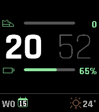
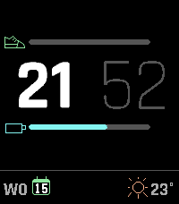
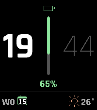
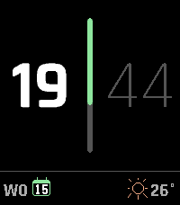
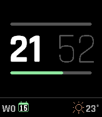
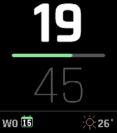
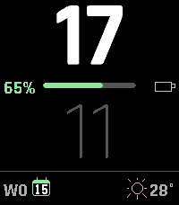

# Demi

A configurable watchface for the **Pebble Time 2** (platform `emery`). Demi shows large
anti-aliased vector digits, a configurable progress bar in one of two layouts, and three
configurable widget slots (date / weather / battery / heart rate) along the bottom.


| | | |
| --- | --- | --- |
|  |  |  |
| 12h AM/PM · orange | Cyan · battery bar + glyph | Blue · distance (Run icon) |
|  |  |  |
| Purple · calories | Yellow · accent-color hours | Magenta · three widget slots (date / battery / weather) |

UUID: `f6cb4093-9dc1-4c3a-8316-d1d79e9e94d8`

## Layouts

Three ways to read the clock: **vertical** (hours above minutes, split by a horizontal bar),
**horizontal** (hours beside minutes, split by a vertical bar), or **horizontal with two
bars** — hours beside minutes, framed by a bar above and below, each tracking its own metric
and, optionally, its own color. Beside each bar you can show the icon and value, the icon
alone, or nothing at all; showing less lengthens the track.

| | |
| --- | --- |
|  |  |
| Two bars · steps above, battery below | Two bars · icons only, second bar in its own color |
|  |  |
| Horizontal · icon above, value below | Horizontal · nothing beside the bar |
|  |  |
| Two bars · nothing beside the bars | Vertical · nothing beside the bar |
|  | |
| Vertical · swapped, so the bar fills right-to-left | |

## Design

- **Hours** and **minutes** in Rajdhani Bold / Light — stacked (~54% / ~49% of the clock
  area) in the vertical layout, or side by side in the horizontal one, where each is scaled
  to fit its own column.
- A **progress bar** (icon + track + value in the accent color) between them, or as a pair
  framing the time in the two-bar layout, where each bar tracks its own metric. The fill
  always grows away from the icon, so swapping the icon and value also reverses it:
  left-to-right becomes right-to-left, top-down becomes bottom-up.
- A **bottom row** of three configurable slots — left / middle / right — each showing one of:
  date, weather, battery, heart rate, or nothing.
- The layout is derived from the real PT2 screen size (no hardcoded dimensions), so it
  adapts under the Timeline Quick View peek.

## Configuration (Clay)

Open the watchface settings in the Pebble app to configure:

| Setting | Options |
| --- | --- |
| **Accent color** | 12-swatch palette: green, mint, cyan, blue, indigo, purple, magenta, pink, red, orange, yellow, white |
| **Hour/minute colors** | white–darkgrey, white–white, white–lightgrey (e-paper), lightgrey–white (e-paper), **accent–white, white–accent, accent–darkgrey, accent–lightgrey** (accent variants track the chosen accent color) |
| **24-hour clock** | on (24h) / off (12h with AM/PM label beside the hour, or below it in the horizontal layout) — default 24h |
| **Layout** | Vertical (hours above minutes) / Horizontal, vertical bar / Horizontal, two bars — default vertical |
| **Progress bar** | Steps / Battery / Calories / Distance |
| **Second bar** | Steps / Battery / Calories / Distance — the lower bar in the two-bar layout, ignored elsewhere — default battery |
| **Beside the bar** | Nothing / Icon only / Icon and value — showing less lengthens the track — default icon and value |
| **Second bar color** | on / off, plus a 12-swatch picker — gives the two-bar layout's lower bar its own color. Off (default) means it follows the main accent, so changing that doesn't strand it |
| **Swap icon and value** | on / off — trades their places and reverses the bar's fill direction with them (vertical: value left, icon right, fills right-to-left; horizontal: value above, icon below, fills bottom-up) — default off |
| **Bottom widgets** | Three slots (left / middle / right), each: None / Date / Weather / Battery / Heart rate — default date / — / weather |
| **Battery percentage** | on / off — show the % beside the battery glyph, or glyph only — default on |
| **Language** (date) | Nederlands / English / Deutsch / Français |
| **Temperature unit** | Celsius / Fahrenheit |
| **Weather icon in accent color** | on / off (off = per-condition colors) — default off |

The **battery** widget is a graphical glyph filled proportionally to the charge level
(accent fill, red below 20%, lightning bolt while charging), optionally followed by the
percentage. The middle slot is skipped automatically if it would overlap a neighbour.

## Status icons

Two automatic status icons appear in the top corners (subtle light-gray outlines, no
configuration):


- **Quiet Time** (mouse, upper-left) when `quiet_time_is_active()`.
- **Bluetooth disconnected** (upper-right) when `connection_service_peek_pebble_app_connection()`
  is false.

Both are 25→22px PDCs from [pebble-dev/iconography](https://github.com/pebble-dev/iconography)
(`Quiet_time_mouse`, `Watch_disconnected`).

## Timeline Quick View

The whole face compresses upward to stay visible above the Timeline Quick View peek, and the
status icons hide during the slide. The heart-rate widget shows `--` when no sensor reading
is available (e.g. in the emulator).

## Weather

Weather is fetched from **[Open-Meteo](https://open-meteo.com/)** (no API key required) in
`src/pkjs/index.js`. The last reading is stored on the watch and shown again immediately on
the next launch, so returning to the face no longer flashes a placeholder while the phone
re-fetches. A stored reading older than **3 hours** is discarded; until real data arrives the
weather slot simply stays empty rather than showing a guessed condition.

WMO weather codes are mapped to 7 conditions by `condFromWMO`:

| # | Condition | Color |
| --- | --- | --- |
| 0 | Sunny | ChromeYellow |
| 1 | Partly cloudy | PictonBlue |
| 2 | Cloudy | PictonBlue |
| 3 | Light rain | PictonBlue |
| 4 | Heavy rain | PictonBlue |
| 5 | Light snow | Celeste |
| 6 | Heavy snow | Celeste |

## Building & installing

With the Pebble SDK on your `PATH`:

```bash
export PATH="$HOME/.local/bin:$PATH"
cd "$(git rev-parse --show-toplevel)"
pebble build
pebble install --emulator emery
python3 tools/release.py              # size-optimized build/Demi-release.pbw for the store
```

`tools/release.py` writes a size-optimized `.pbw` for the appstore (minifies the JS bundle and
drops the source map, roughly halving the download; needs `node`/`npx`).

To install on a real Pebble Time 2, use the **Pebble cloud install** flow (Dev Connect +
`pebble install --cloudpebble`).

For the asset toolchain, build caveats, rendering internals and project layout, see
**[docs/DEVELOPMENT.md](docs/DEVELOPMENT.md)**.

## Credits & licenses

Demi's own source is released under the **MIT License** (see `LICENSE`). Bundled
third-party assets keep their original licenses:

- **Rajdhani** font (`resources/fonts/Rajdhani-*.ttf` and the compiled `.ffont`) —
  © 2014 Indian Type Foundry, designed by Satya Rajpurohit & Jyotish Sonowal.
  Licensed under the **SIL Open Font License 1.1** — see
  [`resources/fonts/OFL.txt`](resources/fonts/OFL.txt).
- **Icons** (`resources/icons/*`) — derived from
  [pebble-dev/iconography](https://github.com/pebble-dev/iconography), licensed
  **Apache-2.0**. The distance icon is `Pebble_25x25_Run.svg`; the battery icon is a
  custom 25×25 SVG.
- **`tools/svg2pdc.py`** and **`tools/pebble_image_routines.py`** — © 2015 Pebble
  Technology, from the Pebble SDK examples (ported to Python 3).
- **Weather** data from [Open-Meteo](https://open-meteo.com/) (no API key required).
