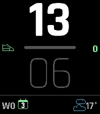
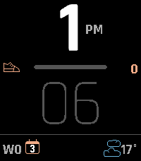
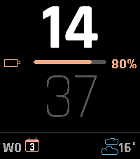
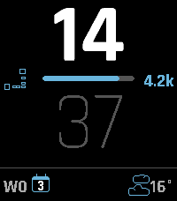
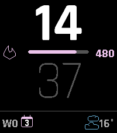
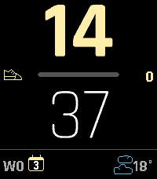
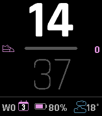
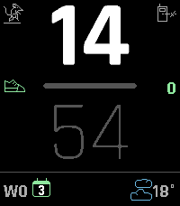

# Demi

A configurable watchface for the **Pebble Time 2** (platform `emery`). Demi shows large
anti-aliased vector digits, a configurable progress bar, and three configurable widget
slots (date / weather / battery / heart rate) along the bottom.



| | | |
| --- | --- | --- |
|  |  |  |
| 12h AM/PM · orange | Cyan · battery bar + glyph | Blue · distance (Run icon) |
|  |  |  |
| Purple · calories | Yellow · accent-color hours | Magenta · three widget slots (date / battery / weather) |

UUID: `f6cb4093-9dc1-4c3a-8316-d1d79e9e94d8`

## Design

- **Hours** on top in Rajdhani Bold (large, ~54% of the clock area), **minutes** below in
  Rajdhani Light (~49%).
- A **progress bar** between them (icon + track + value in the accent color).
- A **bottom row** of three configurable slots — left / middle / right — each showing one of:
  date, weather, battery, heart rate, or nothing.
- Layout is computed dynamically from `layer_get_unobstructed_bounds()` — **no hardcoded
  144×168** (that's basalt). Proportions are derived from the real PT2 screen so the face
  stays correct under the Timeline quick-view peek.

Large digits are drawn with **FCTX vector fonts** (`pebble-fctx`), small text with the
raster TTF `RAJDHANI_BOLD_20`. Icons are **PDC vector** images, recolored at runtime.

## Configuration (Clay)

Open the watchface settings in the Pebble app to configure:

| Setting | Options |
| --- | --- |
| **Accent color** | 12-swatch palette: green, mint, cyan, blue, indigo, purple, magenta, pink, red, orange, yellow, white |
| **Hour/minute colors** | white–darkgrey, white–white, white–lightgrey (e-paper), lightgrey–white (e-paper), **accent–white, white–accent, accent–darkgrey, accent–lightgrey** (accent variants track the chosen accent color) |
| **24-hour clock** | on (24h) / off (12h with AM/PM label right of the hour) — default 24h |
| **Progress bar** | Steps / Battery / Calories / Distance |
| **Bottom widgets** | Three slots (left / middle / right), each: None / Date / Weather / Battery / Heart rate — default date / — / weather |
| **Battery percentage** | on / off — show the % beside the battery glyph, or glyph only — default on |
| **Language** (date) | Nederlands / English / Deutsch / Français |
| **Temperature unit** | Celsius / Fahrenheit |
| **Weather icon in accent color** | on / off (off = per-condition colors) — default off |

The **battery** widget is a graphical glyph filled proportionally to the charge level
(accent fill, red below 20%, lightning bolt while charging), optionally followed by the
percentage. The middle slot is skipped automatically if it would overlap a neighbour.

## Status icons

Two automatic status icons appear in the top corners (subtle light-gray outlines, no
configuration):



- **Quiet Time** (mouse, upper-left) when `quiet_time_is_active()`.
- **Bluetooth disconnected** (upper-right) when `connection_service_peek_pebble_app_connection()`
  is false.

Both are 25→22px PDCs from [pebble-dev/iconography](https://github.com/pebble-dev/iconography)
(`Quiet_time_mouse`, `Watch_disconnected`).

## Timeline Quick View

The face subscribes to the unobstructed-area service (`unobstructed_area_service_subscribe`)
and recomputes every layer frame from `layer_get_unobstructed_bounds()` in an `apply_layout`
helper, so the clock/progress/bottom row compress upward and stay visible above the ~51px
Timeline peek. The status icons are hidden during the slide.

The heart-rate widget reads `HealthMetricHeartRateBPM` via `health_service_peek_current_value`
and shows `--` when no sensor is available (e.g. in the emulator).

## Weather

Weather is fetched from **[Open-Meteo](https://open-meteo.com/)** (no API key required) in
`src/pkjs/index.js`. WMO weather codes are mapped to 7 conditions by `condFromWMO`:

| # | Condition | Color |
| --- | --- | --- |
| 0 | Sunny | ChromeYellow |
| 1 | Partly cloudy | PictonBlue |
| 2 | Cloudy | PictonBlue |
| 3 | Light rain | PictonBlue |
| 4 | Heavy rain | PictonBlue |
| 5 | Light snow | Celeste |
| 6 | Heavy snow | Celeste |

## Building & running

Non-login shells need the SDK on `PATH` first:

```bash
export PATH="$HOME/.local/bin:$PATH"
cd "$(git rev-parse --show-toplevel)"
pebble build
pebble install --emulator emery
pebble screenshot --emulator emery demi.png
```

> **Always `pebble clean` before `pebble build` after changing any resource.** A plain
> incremental build (~0.1s) does **not** re-pack changed resources that keep the same
> filename — font subsets and `.pdc`/`.ffont`/raw files stay cached. A clean build (~1.3s)
> fixes "icon swap / font regex seems ignored / icon invisible" symptoms.

Other notes:

- After changing `messageKeys` in `package.json`, run `pebble clean` so the generated
  `message_keys.auto.h` is regenerated.
- `pebble`/`uv` print harmless Python 3.13 `SyntaxWarning`s from libpebble2 — filter with
  `grep -viE 'SyntaxWarning|escape sequence|:param'`.
- To stop the emulator use `pebble kill` or `pkill -x qemu-pebble` — **not**
  `pkill -f qemu-pebble` (it matches your own shell command → self-kill, exit 144).
- On an emulator bootloop/hang: `pebble wipe` (do **not** `kill -9` qemu — that corrupts
  state into a bootloop).

To install on a real Pebble Time 2, see the **Pebble cloud install** flow (Dev Connect +
`pebble install --cloudpebble`).

## Asset toolchain (`tools/`)

Vector fonts and icons are precompiled into `resources/`:

- **`.ffont`** — `tools/ttf2svgfont.py` (`uv run --with fonttools`) builds an SVG font of
  digits 0–9 from a TTF, then `node_modules/.bin/fctx-compiler <svg> -r '[0-9]'` produces
  the `.ffont`.
- **`.pdc`** — icons from [pebble-dev/iconography](https://github.com/pebble-dev/iconography)
  (official PebbleOS SVGs, Apache 2.0, 25×25, white-fill + black-stroke) → `tools/svg2pdc.py`
  → `.pdc` (run via `uv run --with svg.path`). The battery icon is a custom 25×25 SVG.
  - All icons are recolored by `draw_pdc` in `demi.c` (outline/line-art: transparent fill,
    1px accent-colored stroke), used for both the progress-bar and bottom-row icons.
  - `svg2pdc.py` takes an optional `-S/--scale FACTOR` that uniformly scales coordinates
    **and** the declared image bounds — used to bring large sources down to the ~22px
    status-icon size (e.g. `--scale 0.28` for the 80×80 quiet-time mouse, `--scale 0.44`
    for the 50×50 watch-disconnected).
  - `svg2pdc.py` is ported to Python 3 and made resilient: it **rounds** off-grid points
    instead of failing, and **drops degenerate paths** (<2 points). The latter is critical —
    Adobe-exported SVGs can contain a lone `moveto` that yields a 0-point command, which
    makes the **entire** `.pdc` fail to load (`gdraw_command_image_create_with_resource`
    returns NULL → icon invisible).

The small font regex (`RAJDHANI_BOLD_20`, `[-0-9A-Za-z °%.k]`) **must** include a space and
`-`, otherwise `" "` / `"-"` render as missing-glyph boxes.

## Project layout

```
package.json          # app config, messageKeys, resources (Pebble "pebble" block)
src/c/demi.c          # watchface: layout, FCTX digits, PDC recolor, widgets
src/c/config.h/.c     # Clay config keys + AppMessage handling
src/pkjs/index.js     # phone JS: Open-Meteo fetch, WMO mapping, AppMessage
src/pkjs/config.json  # Clay configuration UI
resources/fonts/      # Rajdhani TTF + compiled .ffont
resources/icons/      # source .svg + compiled .pdc
tools/                # ttf2svgfont.py, svg2pdc.py, pebble_image_routines.py
```

## Dependencies

- `pebble-clay` — configuration UI
- `pebble-fctx` — anti-aliased vector text
- `pebble-fctx-compiler` (dev) — builds `.ffont` files

## Credits & licenses

Demi's own source is released under the **MIT License** (see `LICENSE`). Bundled
third-party assets keep their original licenses:

- **Rajdhani** font (`resources/fonts/Rajdhani-*.ttf` and the compiled `.ffont`) —
  © 2014 Indian Type Foundry, designed by Satya Rajpurohit & Jyotish Sonowal.
  Licensed under the **SIL Open Font License 1.1** — see
  [`resources/fonts/OFL.txt`](resources/fonts/OFL.txt).
- **Icons** (`resources/icons/*`) — derived from
  [pebble-dev/iconography](https://github.com/pebble-dev/iconography), licensed
  **Apache-2.0**. The distance icon is `Pebble_25x25_Run.svg`; the battery icon is a
  custom 25×25 SVG.
- **`tools/svg2pdc.py`** and **`tools/pebble_image_routines.py`** — © 2015 Pebble
  Technology, from the Pebble SDK examples (ported to Python 3).
- **Weather** data from [Open-Meteo](https://open-meteo.com/) (no API key required).
