# Demi

A configurable watchface for the **Pebble Time 2** (platform `emery`). Demi shows large
anti-aliased vector digits, a configurable progress bar in one of three layouts, and three
configurable widget slots (date / weather / battery / heart rate / sunrise–sunset) along the
bottom.

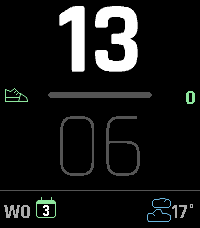

| | | |
| --- | --- | --- |
| 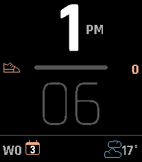 | 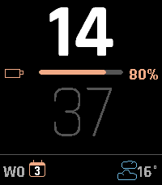 | 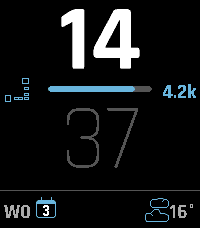 |
| 12h AM/PM · orange | Cyan · battery bar + glyph | Blue · distance (Run icon) |
| 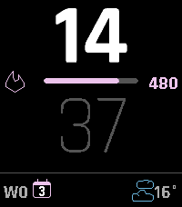 | 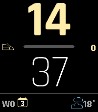 | 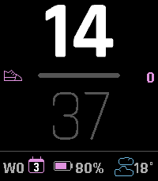 |
| Purple · calories | Yellow · accent-color hours | Magenta · three widget slots (date / battery / weather) |
| 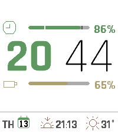 | 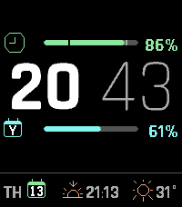 | 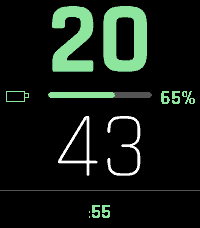 |
| Light theme · day and battery bars | Day + year elapsed · second bar in its own color | Tap reveal · hidden bar detail and the seconds |

UUID: `f6cb4093-9dc1-4c3a-8316-d1d79e9e94d8`

## Layouts

Three ways to read the clock: **vertical** (hours above minutes, split by a horizontal bar),
**horizontal** (hours beside minutes, split by a vertical bar), or **horizontal with two
bars** — hours beside minutes, framed by a bar above and below, each tracking its own metric
and, optionally, its own color. Beside each bar you can show the icon and value, the icon
alone, or nothing at all; showing less lengthens the track.

| | |
| --- | --- |
| 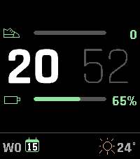 | 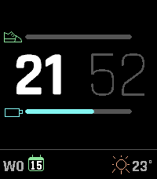 |
| Two bars · steps above, battery below | Two bars · icons only, second bar in its own color |
| 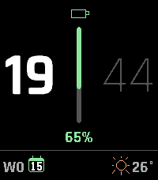 | 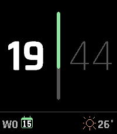 |
| Horizontal · icon above, value below | Horizontal · nothing beside the bar |
| 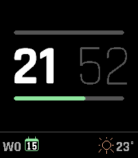 | 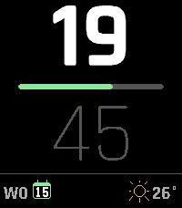 |
| Two bars · nothing beside the bars | Vertical · nothing beside the bar |
| 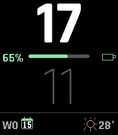 | |
| Vertical · swapped, so the bar fills right-to-left | |

## Design

- **Hours** and **minutes** in Rajdhani Bold / Light — stacked (~54% / ~49% of the clock
  area) in the vertical layout, or side by side in the horizontal one, where each is scaled
  to fit its own column.
- A **progress bar** (icon + track + value in the accent color) between them, or as a pair
  framing the time in the two-bar layout, where each bar tracks its own metric. The fill
  always grows away from the icon, so swapping the icon and value also reverses it:
  left-to-right becomes right-to-left, top-down becomes bottom-up.
- A **bottom row** of three configurable slots — left / middle / right — each showing one of:
  date, weather, battery, heart rate, or nothing.
- The layout is derived from the real PT2 screen size (no hardcoded dimensions), so it
  adapts under the Timeline Quick View peek.

## Configuration (Clay)

Open the watchface settings in the Pebble app to configure:

| Setting | Options |
| --- | --- |
| **Background** | Dark (white on black) / Light (black on white) — default dark |
| **Accent color** | 12-swatch palette: green, mint, cyan, blue, indigo, purple, magenta, pink, red, orange, yellow, white |
| **Hour/minute contrast** | strong–faintest, strong–strong, strong–soft, soft–strong, **accent–strong, strong–accent, accent–faintest, accent–soft** (accent variants track the chosen accent color) — named by contrast rather than colour, since both themes use the same eight |
| **24-hour clock** | on (24h) / off (12h with AM/PM label beside the hour, or below it in the horizontal layout) — default 24h |
| **Layout** | Vertical (hours above minutes) / Horizontal, vertical bar / Horizontal, two bars — default vertical |
| **Progress bar** | Steps / Battery / Calories / Distance / Custom 1 / Custom 2 / Daylight / Day, week, month or year elapsed |
| **Second bar** | Same list — the lower bar in the two-bar layout, ignored elsewhere — default battery |
| **Beside the bar** | Nothing / Icon only / Icon and value — showing less lengthens the track — default icon and value |
| **Second bar color** | on / off, plus a 12-swatch picker — gives the two-bar layout's lower bar its own color. Off (default) means it follows the main accent, so changing that doesn't strand it |
| **Swap icon and value** | on / off — trades their places and reverses the bar's fill direction with them (vertical: value left, icon right, fills right-to-left; horizontal: value above, icon below, fills bottom-up) — default off |
| **Bottom widgets** | Three slots (left / middle / right), each: None / Date / Weather / Battery / Heart rate / Sunrise–sunset — default date / — / weather |
| **Battery percentage** | on / off — show the % beside the battery glyph, or glyph only — default on |
| **Goals** | Step, calorie and distance targets — where each bar reaches 100%. `0` means "use my own daily average" |
| **Usual pace** | on / off — a mark on the bar showing where you normally stand at this time of day — default off |
| **Distance unit** | Automatic (the watch's own setting) / Kilometres / Miles — default automatic |
| **Tap on the watch** | Nothing / Seconds / Full date — default nothing |
| **Show icon and value on tap** | on / off — a tap also expands the bars to icon + value, for a face kept bare — default off |
| **Language** (date + settings page) | Automatic (watch language) / English / Nederlands / Français / Deutsch / Español — default automatic |
| **Temperature unit** | Celsius / Fahrenheit |
| **Weather icon in accent color** | on / off (off = per-condition colors) — default off |

The **battery** widget is a graphical glyph filled proportionally to the charge level
(accent fill, red below 20%, lightning bolt while charging), optionally followed by the
percentage. The middle slot is skipped automatically if it would overlap a neighbour.

## Themes


*The light theme, same face and same accent: the spring green is darkened just enough to
hold against white, the track and the widget-row divider swap to light grey, and the sunrise
marks on the day bar stay legible on both halves of the bar.*

The **background** setting flips the face between white-on-black and black-on-white. Rather
than inverting colours at draw time, every neutral is drawn through one of four named roles:

| role | dark | light | used by |
| --- | --- | --- | --- |
| background | black | white | the window, and a bar mark that lands on the accent fill |
| strong foreground | white | black | hour digits, the calendar label, the charging bolt |
| quiet foreground | light grey | dark grey | widget text, status icons, the battery outline |
| track | dark grey | light grey | the unfilled part of a bar, the widget-row divider |

Naming the role at each call site is what keeps the complications honest: there is no
"white" to reach for, only "the strong foreground", so a new complication cannot end up
unreadable in one theme by accident. The icons need no second set — they are PDC line art
recoloured at draw time.

**Accent colours are darkened on the light theme, but only when they need it.** The
12-swatch palette was chosen against black: a white accent would disappear on white and
yellow would wash out. `themed_accent()` measures lightness with green weighted double —
which is why yellow (3,3,0) and cyan (0,3,3) count as light while magenta (3,1,3) does not —
and steps each channel down once when it exceeds the threshold, taking a neutral all the way
to dark grey since a grey has no hue worth preserving. Blue, red and the darker greens pass
through untouched, so most faces look identical in both themes. Nothing is written back to
your stored colour, so switching themes is always reversible.

Weather icons swap hue as well: chrome yellow and celeste read well on black and vanish on
white, so the light theme uses Windsor tan, cobalt blue and blue moon instead.

## Status icons

Two automatic status icons appear in the top corners (subtle light-gray outlines, no
configuration):

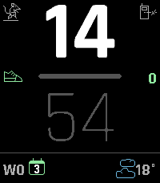

- **Quiet Time** (mouse, upper-left) when `quiet_time_is_active()`.
- **Bluetooth disconnected** (upper-right) when `connection_service_peek_pebble_app_connection()`
  is false.

Both are 25→22px PDCs from [pebble-dev/iconography](https://github.com/pebble-dev/iconography)
(`Quiet_time_mouse`, `Watch_disconnected`).

## Timeline Quick View

The whole face compresses upward to stay visible above the Timeline Quick View peek, and the
status icons hide during the slide. The heart-rate widget shows `--` when no sensor reading
is available (e.g. in the emulator).

## Weather

Weather is fetched from **[Open-Meteo](https://open-meteo.com/)** (no API key required) in
`src/pkjs/index.js`. The last reading is stored on the watch and shown again immediately on
the next launch, so returning to the face no longer flashes a placeholder while the phone
re-fetches. A stored reading older than **3 hours** is discarded; until real data arrives the
weather slot simply stays empty rather than showing a guessed condition.

WMO weather codes are mapped to 7 conditions by `condFromWMO`:

| # | Condition | Color |
| --- | --- | --- |
| 0 | Sunny | ChromeYellow |
| 1 | Partly cloudy | PictonBlue |
| 2 | Cloudy | PictonBlue |
| 3 | Light rain | PictonBlue |
| 4 | Heavy rain | PictonBlue |
| 5 | Light snow | Celeste |
| 6 | Heavy snow | Celeste |

## Sunrise & sunset

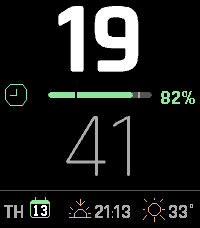

*Day-elapsed bar at 82%, with sunrise and sunset marked on the track — the first notch sits
inside the fill, the second still ahead of it. The middle widget slot shows the next sun
event: sunset at 21:13.*

The same Open-Meteo request also asks for `daily=sunrise,sunset` with `timezone=auto`, so
there is no second round trip and still no API key. The phone parses both to **minutes
since local midnight** and sends them alongside the weather.

- The **sunrise–sunset widget** shows whichever event comes next: the sunrise time before
  dawn, the sunset time after it. It uses PebbleOS's own `Sunrise` / `Sunset` icons — a half
  sun over a horizon with the arrow built in — which keeps it from being read as the weather
  slot's bare sun. After sunset it shows today's sunrise, which differs from tomorrow's by
  about a minute.
- The **Daylight** progress bar fills from sunrise to sunset, labelled with the daylight
  still left (`3h15`) — or, before dawn, the wait until it (`45m`).

Both are kept for **26 hours** rather than the weather's 3: this morning's sunrise is still
correct tonight, while this morning's temperature is not. With nothing known, the widget
claims no space and the bar shows `--`, the same contract the weather slot follows.

## Goals, pace and units

The step, calorie and distance bars each have their own goal — where the bar reaches 100%.
Entering **`0`** means "use my own daily average": the watch answers from its own health
history via `health_service_sum_averaged`, falling back to the old fixed targets (10000
steps / 600 kcal / 5000 m) when it has no history yet.

The optional **usual-pace mark** draws a 2px line across the track at the point you
normally reach by this time of day, so the fill can be read against it. It only appears for
the three health metrics — nothing else has a "normal for now".

Beside the track, the day bar shows a clock glyph, while **week, month and year draw the
same calendar box the date widget uses**, with the period's initial inside — `W`/`M`/`J` in
Dutch, `W`/`M`/`Y` in English, `S`/`M`/`A` in French and Spanish, following the configured
language. PebbleOS has no week/month/year icons, and one shared calendar icon would leave
the three indistinguishable.

The **day-elapsed bar** carries two marks of its own, needing no setting: **sunrise and
sunset**, at their positions within the 24 hours the bar spans. It turns a bare percentage
into something you can read at a glance — how much daylight is behind you and how much is
left. They are deliberately absent from the daylight bar, where they would sit at 0% and
100% by definition, and from the week/month/year bars, where a single day's light is too
compressed to mean anything.

Marks are drawn **black where they land on the accent fill and light grey where they land
on the bare track**, since either colour alone disappears against one half of the bar.

Distance is stored and sent in **meters** throughout; only the drawing converts. By default
the unit follows the watch's own setting, read with
`health_service_get_measurement_system_for_display()`, and it can be pinned to kilometres or
miles. The settings page shows the goal field in the matching unit, and the phone converts
whatever you type to meters before sending.

## Tap to reveal

Two independent settings decide what a tap does, and a tap is only listened for when at
least one of them is on:

- **Tap on the watch** (nothing / seconds / full date) replaces the bottom widget row for
  five seconds.
- **Show icon and value on tap** temporarily expands the progress bars to icon + value. It
  earns its place when "beside the bar" is set to nothing or icon-only: the face stays as
  bare as you wanted it, and still gives up the numbers when you ask. The track shortens to
  make room, exactly as it would if the detail were permanent.

With **Tap on the watch** set to seconds or the full date, the seconds tick live (the watch
drops to second-unit ticks only for those five seconds), the date does not. The date reads `TH 13 AUG 2026`,
using three-letter ASCII month abbreviations in the configured language, since the small
font's `characterRegex` excludes accented glyphs. Off by default: an unexpected reveal on
every knock is worse than a feature nobody asked for, and off means the accelerometer is
never subscribed at all.

## Custom metrics (JSON url)

The **Custom 1** / **Custom 2** progress-bar types let you track any percentage-based
stat that isn't steps/battery/calories/distance. In settings, under "Custom (JSON url)",
enter a url that returns:

```json
{ "items": [ { "name": "session", "value": 42 }, { "name": "week", "value": 78 } ] }
```

`value` is 0–100; item 0 maps to Custom 1, item 1 to Custom 2. The icon is picked from
`name`: an hourglass for anything containing "session", a burst icon for anything
containing "week", otherwise a generic gauge dial.

**Privacy:** the url itself is only ever read by the phone (`src/pkjs/index.js`,
`fetchCustom`) and stored in `localStorage` — it is stripped from the settings dict
before anything is sent to the watch, so only the parsed percentage and icon id cross
Bluetooth. The fetch is refused outright past 8KB (checked during download and again
before parsing), and the watch independently clamps whatever it receives to 0–100
before it reaches the bar-width math, rather than trusting the phone unconditionally.
Refreshed every ~3 minutes.

## Building & installing

With the Pebble SDK on your `PATH`:

```bash
export PATH="$HOME/.local/bin:$PATH"
cd "$(git rev-parse --show-toplevel)"
pebble build
pebble install --emulator emery
python3 tools/release.py              # size-optimized build/Demi-release.pbw for the store
```

`tools/release.py` writes a size-optimized `.pbw` for the appstore (minifies the JS bundle and
drops the source map, roughly halving the download; needs `node`/`npx`).

To install on a real Pebble Time 2, use the **Pebble cloud install** flow (Dev Connect +
`pebble install --cloudpebble`).

For the asset toolchain, build caveats, rendering internals and project layout, see
**[docs/DEVELOPMENT.md](docs/DEVELOPMENT.md)**.

## Credits & licenses

Demi's own source is released under the **MIT License** (see `LICENSE`). Bundled
third-party assets keep their original licenses:

- **Rajdhani** font (`resources/fonts/Rajdhani-*.ttf` and the compiled `.ffont`) —
  © 2014 Indian Type Foundry, designed by Satya Rajpurohit & Jyotish Sonowal.
  Licensed under the **SIL Open Font License 1.1** — see
  [`resources/fonts/OFL.txt`](resources/fonts/OFL.txt).
- **Icons** (`resources/icons/*`) — derived from
  [pebble-dev/iconography](https://github.com/pebble-dev/iconography), licensed
  **Apache-2.0**. The distance icon is `Pebble_25x25_Run.svg`; the sun widget uses
  `Pebble_25x25_Sunrise.svg` / `Sunset.svg`; the day-elapsed bar uses
  `Pebble_25x25_Duration.svg`; the battery icon is a custom 25×25 SVG, and the calendar box
  (date widget and the week/month/year bars) is drawn in C rather than shipped as an asset.
- **`tools/svg2pdc.py`** and **`tools/pebble_image_routines.py`** — © 2015 Pebble
  Technology, from the Pebble SDK examples (ported to Python 3).
- **Weather** data from [Open-Meteo](https://open-meteo.com/) (no API key required).
